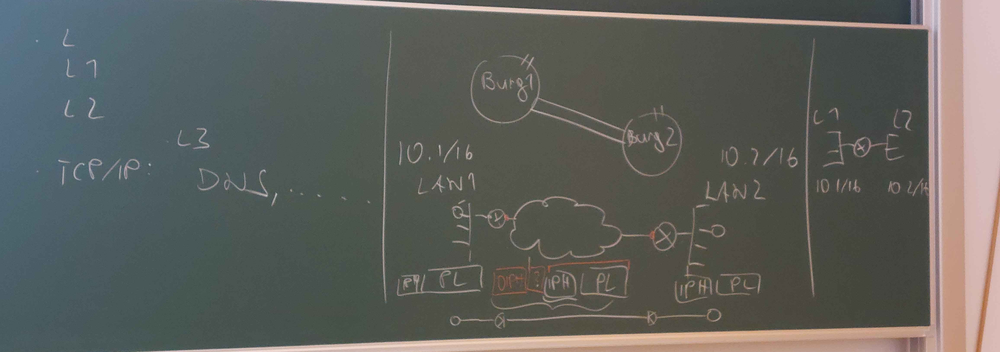

# Netzwerktechnik

## 13.09.2024

### Netzwerksicherheit

Sicherheit ist durch die Kommerzialisierung des Internet ein allgegenwärtiges und notwendiges Thema.

Strategien:

- Firewalls
  - Paketfilter eines Netzwerkes von/nach außen. Keine Isolation!
- VPNs
  - Vertrauliche Kommunikation über sichere Netze => Tunnel

VPNs sind wie ein Tunnen zwischen Burgen. Das IP Packet wird verschlüsselt in eimem anderen IP Packet verpackt und dann verschickt. Der Empfänger entpackt das Paket und kann es lesen.

Zur Encryption braucht man einen key(früher 64 bit, heute 128 oder 256 bit also 2²⁵⁶ Möglichkeiten).

Der Äußere Header wird verwendet um das Paket von Router 1 zu Router 2 zu schicken. Die TimeToLive/HopCount wird vom inneren Paket nicht reduziert, daher sieht es aus, als ob das Paket direkt zum Empfänger geschickt wird.

Was wollen wir schützen?

- Daten
  - Geheimhaltung => Verschlüsselung
  - Integrität => Signatur
  - Vefügbarkeit => Am schwierigsten
- Computer
  - unerlaubte fVerwendung
- Reputation

Von wem?

- Vandalen
  - leicht zu entdecken, unterschiedliche Motivationen(destruktiv oder konstruktiv)
- Spione
  - Geheimer Angriff
- interne Benutzer
  - Oft keine Absicht, mangelndes Sicherheitsbewustsein mit internen Zugriffsrechten
